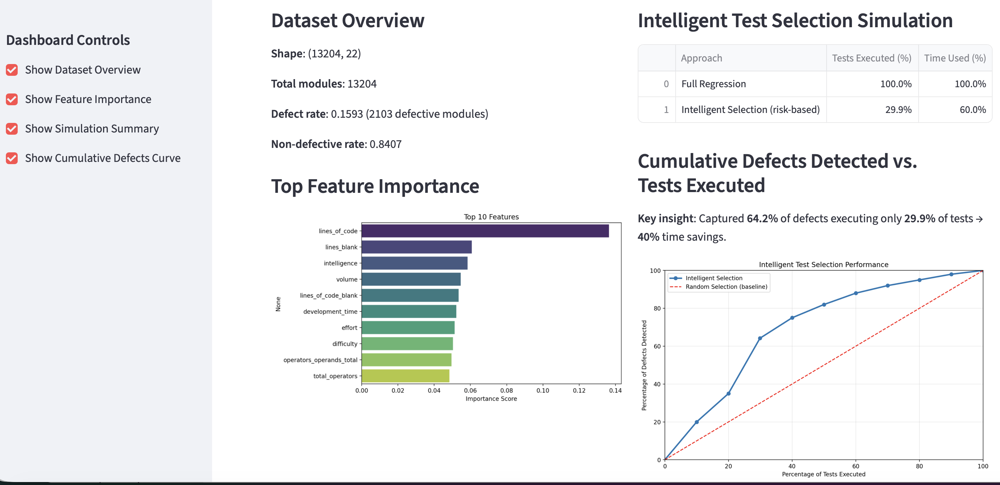
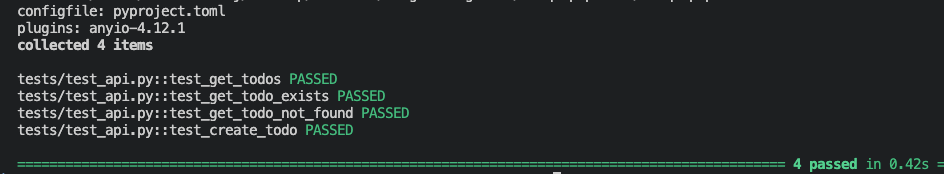
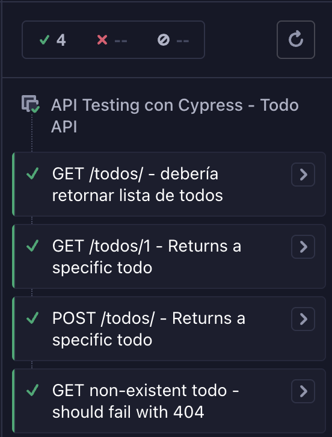
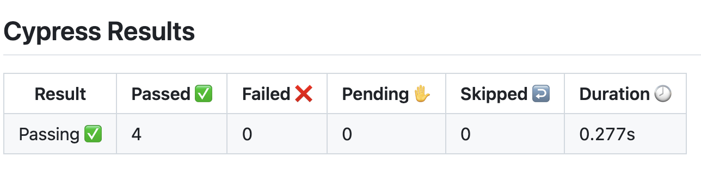

# AI-Driven QA Pipeline

[](https://github.com/crisemy/ai-qa-pipeline/actions/workflows/ci.yml)
[](https://www.python.org/)
[](https://opensource.org/licenses/MIT)

**Intelligent regression testing pipeline combining traditional QA automation with data-driven insights and AI-assisted test selection.**

**2026 Goal**: Demonstrate CI/CD-integrated pipelines that reduce regression cycle time by ~40% and post-release defects by ~25% through risk-based, ML-driven test prioritization.

## Key Results (Simulation)

Using NASA PROMISE JM1 dataset + Random Forest + SMOTE:

- Captured **64.2% of defects** by executing only **29.9% of tests**  
- Simulated **40% reduction in regression cycle time** (using LOC as time proxy)  
- Defects missed: **35.8%**

| Approach                          | Tests Executed (%) | Time Used (%) | Defects Detected (%) | Time Saved (%) | Defects Missed (%) |
|-----------------------------------|--------------------|---------------|----------------------|----------------|--------------------|
| Full Regression                   | 100.0             | 100.0        | 100.0               | 0.0           | 0.0               |
| Intelligent Selection (risk-based)| 29.9              | 60.0         | 64.2                | 40.0          | 35.8              |

  
*(Cumulative defects detected vs. percentage of tests executed – intelligent vs. random)*

## Current Features
- FastAPI sample Todo API
- Unit & integration tests (pytest + httpx)
- E2E API testing (Cypress with `cy.request`)
- Full CI pipeline (GitHub Actions): lint (Ruff), unit tests, E2E tests
- Defect prediction baseline with Random Forest on NASA PROMISE JM1
- Class imbalance handling with SMOTE
- Intelligent test selection simulation (risk-based prioritization)

## Tech Stack
- Backend/API: FastAPI, Uvicorn
- Testing: pytest, httpx, Cypress
- CI/CD: GitHub Actions
- Data Science: Pandas, scikit-learn (RandomForest), imbalanced-learn (SMOTE)
- Visualization: Matplotlib, Seaborn
- Future: Streamlit dashboard

## Local Setup

1. Clone the repository
   ```bash
   git clone https://github.com/crisemy/ai-qa-pipeline.git
   cd ai-qa-pipeline

2. Create and activate virtual environment
    ```bash
    python -m venv .venv
    source .venv/bin/activate   # Linux/macOS or on Windows: .venv\Scripts\activate

3. Install dependencies
    ```bash
    pip install -r requirements.txt
    pip install "uvicorn[standard]"

4. Run the API
    ```bash
    python -m uvicorn src.main:app --reload

5. Run Unit Tests
    ```bash
    python -m pytest tests/ -v

  

6. Run Cypress E2E tests (API)
    ```bash
    npx cypress open

  

## CI/CD
Every push/PR triggers GitHub Actions workflow that runs:
- Ruff linting
- pytest unit tests
- Cypress E2E tests (server auto-started)
See: .github/workflows/ci.yml



## Noteboooks
- notebooks/01_jm1_exploration_preprocessing.ipynb – EDA & cleaning
- notebooks/02_jm1_random_forest_baseline.ipynb

6. Streamlit
    ```bash
   streamlit run dashboard.py


## MIT License – feel free to use, modify, and share.

crisemy@gmail.com / https://www.linkedin.com/in/cristian-gn/

Looking forward to connecting with QA, Test Automation, and AI-in-QA professionals!
Happy testing!